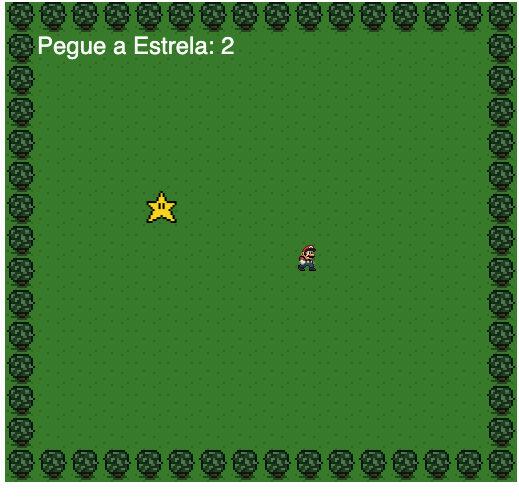

<h1 align="center">Primeiro jogo feito em JS</h1>
 

  

 

## Descrição

Jogo em que o Mario tem que pegar a estrala, feito em HTML, CSS e JavaScrip.
Jogo simples feito para pegar os conceitos em programação

## 🚀 Jogue Agora

[Clique aqui](https://ramomoliveira.github.io/primeiro-jogo-js/)
